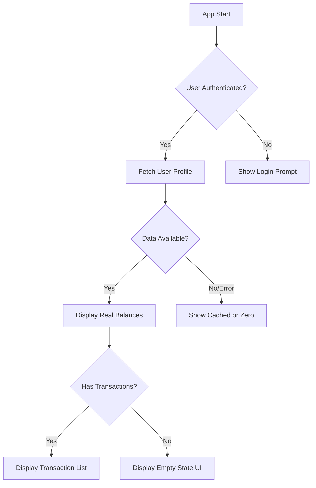

# Design Document: New User Clean State

## Overview

This design addresses the issue where new users see demo/fake balance and transaction data instead of their actual (zero) balances. The solution involves removing hardcoded demo data, implementing proper data fetching from the backend/user profile, and creating professional empty state UIs for a polished user experience.

## Architecture

The solution follows a clean architecture pattern where:

1. **Data Layer**: User balances and transactions are fetched from the backend API or local cache
2. **State Management**: Provider pattern manages user state, with clear distinction between authenticated and unauthenticated states
3. **UI Layer**: Screens display actual user data with appropriate loading, empty, and error states



## Components and Interfaces

### 1. AuthProvider Updates

Remove demo data and use actual user balances:

```dart
class AuthProvider with ChangeNotifier {
  User? _user;
  
  // Remove: final double _demoBdtBalance = 100.0;
  // Use actual user balance from _user.balance
  
  double get bdtBalance => _user?.balance ?? 0.0;
  double get inrBalance => _user?.inrBalance ?? 0.0;
  bool get hasTransactions => _withdrawalRequests.isNotEmpty || 
                               _exchangeRequests.isNotEmpty || 
                               _depositRequests.isNotEmpty;
}
```

### 2. HomeScreen Updates

Replace hardcoded demo values with actual user data:

```dart
// Before: final double _demoBdtBalance = 100.0;
// After: Use authProvider.bdtBalance

Widget _buildBalanceCard() {
  final authProvider = context.watch<AuthProvider>();
  final balance = authProvider.bdtBalance;
  // Display actual balance
}
```

### 3. WalletScreen Updates

Remove hardcoded demo balances:

```dart
// Before:
// final double _bdtBalance = 12500.00;
// final double _inrBalance = 8750.00;

// After: Fetch from AuthProvider
final bdtBalance = authProvider.bdtBalance;
final inrBalance = authProvider.inrBalance;
```

### 4. Empty State Widget

Create a reusable empty state component:

```dart
class EmptyStateWidget extends StatelessWidget {
  final String title;
  final String message;
  final IconData icon;
  final String? actionLabel;
  final VoidCallback? onAction;
  
  // Professional empty state with icon, message, and optional CTA
}
```

### 5. TransactionsScreen Updates

Show empty state when no transactions exist:

```dart
Widget _buildTransactionsList() {
  if (transactions.isEmpty && !hasAnyPendingRequests) {
    return EmptyStateWidget(
      title: 'No Transactions Yet',
      message: 'Your transaction history will appear here',
      icon: Icons.receipt_long_outlined,
      actionLabel: 'Make First Exchange',
      onAction: () => navigateToExchange(),
    );
  }
  // Display actual transactions
}
```

## Data Models

### User Model (Existing)

```dart
class User {
  final String id;
  final String phone;
  final String? email;
  final String? fullName;
  final String kycStatus;
  final double balance;      // BDT balance from backend
  final double inrBalance;   // INR balance from backend
  // ...
}
```

### Empty State Configuration

```dart
class EmptyStateConfig {
  final String title;
  final String message;
  final IconData icon;
  final Color iconColor;
  final String? actionLabel;
  
  static const transactions = EmptyStateConfig(
    title: 'No Transactions Yet',
    message: 'Start exchanging to see your history here',
    icon: Icons.receipt_long_outlined,
    iconColor: Color(0xFF6366F1),
    actionLabel: 'Exchange Now',
  );
  
  static const pendingWithdrawals = EmptyStateConfig(
    title: 'No Pending Withdrawals',
    message: 'Your withdrawal requests will appear here',
    icon: Icons.account_balance_wallet_outlined,
    iconColor: Color(0xFF3B82F6),
  );
  
  // Similar configs for deposits, exchanges
}
```

## Correctness Properties

*A property is a characteristic or behavior that should hold true across all valid executions of a system-essentially, a formal statement about what the system should do. Properties serve as the bridge between human-readable specifications and machine-verifiable correctness guarantees.*

### Property 1: Balance Display Accuracy
*For any* authenticated user, the displayed BDT and INR balances SHALL equal the user's actual balance values from their profile data.
**Validates: Requirements 1.1, 3.1, 3.2, 4.1**

### Property 2: New User Zero Balance
*For any* newly registered user with no completed transactions, the displayed balances SHALL be zero (0.00) for both BDT and INR.
**Validates: Requirements 1.1, 1.4**

### Property 3: No Demo Data Display
*For any* user state (new or existing), the system SHALL NOT display any hardcoded demo values; all displayed values SHALL match the user's actual data.
**Validates: Requirements 1.4, 2.4**

### Property 4: Unauthenticated State Handling
*For any* unauthenticated user attempting to view balance information, the system SHALL display a login prompt instead of any balance values.
**Validates: Requirements 3.3, 4.3**

### Property 5: INR Calculation Accuracy
*For any* BDT balance and exchange rate, the displayed INR equivalent SHALL equal BDT balance multiplied by the current exchange rate.
**Validates: Requirements 4.2**

### Property 6: Empty State Display
*For any* list (transactions, withdrawals, deposits, exchanges) that is empty, the system SHALL display an empty state UI instead of an empty list or demo data.
**Validates: Requirements 2.1, 6.1, 6.2, 6.3**

### Property 7: Cache Fallback
*For any* backend unavailability scenario, the system SHALL display the last cached balance value, or zero if no cache exists.
**Validates: Requirements 1.3**

## Error Handling

### Balance Fetch Failure
- Display cached balance if available
- Show error indicator with retry button
- Never fall back to demo/fake data

### Transaction Fetch Failure
- Display cached transactions if available
- Show error state with retry option
- Empty state if no cache and no data

### Network Timeout
- Use cached data with "Last updated" timestamp
- Background retry with exponential backoff

## Testing Strategy

### Unit Tests
- Test balance display logic with various user states
- Test empty state widget rendering
- Test cache fallback behavior

### Property-Based Tests
Using the `flutter_test` package with custom property testing:

1. **Balance Accuracy Property Test**
   - Generate random user profiles with various balance values
   - Verify displayed balance matches user.balance
   - Run 100+ iterations

2. **New User Zero Balance Property Test**
   - Generate new user states
   - Verify all balances display as 0.00
   - Run 100+ iterations

3. **INR Calculation Property Test**
   - Generate random BDT balances and exchange rates
   - Verify INR = BDT * rate
   - Run 100+ iterations

4. **Empty State Property Test**
   - Generate empty list states
   - Verify empty state UI is displayed
   - Run 100+ iterations

### Integration Tests
- Test full flow from login to balance display
- Test transaction history loading
- Test empty state to first transaction flow
